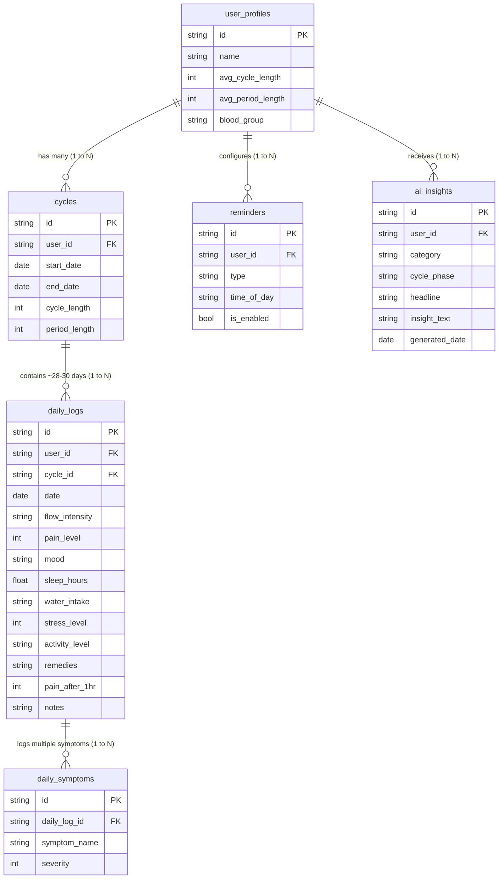

# 🗄️ Bloom Unified Database Schema (Drift & PostgreSQL)

To guarantee **seamless, frictionless two-way synchronization** between the local offline app (Drift/SQLite) and the cloud backend (Supabase/PostgreSQL), both schemas share the exact same table names, column names, data types, and synchronization metadata.

---

## 🔑 Core Sync Design Rules

1. **UUID Primary Keys (`id`):** Every entity uses a client-generated `UUID v4` string as its primary key. This allows the offline app to create new records (cycles, logs, symptoms) instantly without needing an internet connection or waiting for a server auto-increment ID.
2. **Sync Tracking Metadata:** Every table contains:
   * `is_synced` (BOOLEAN DEFAULT false) — Marked `true` once uploaded to Supabase.
   * `updated_at` (TIMESTAMP WITH TIME ZONE) — Used for conflict resolution (Last-Write-Wins).
   * `is_deleted` (BOOLEAN DEFAULT false) — Soft deletes ensure offline deletions properly sync to the cloud.

---

## 📊 Entity Relationship Diagram (ERD)

---

## 📋 Tables Specification

### 1. `user_profiles`
Stores user personal info, baseline cycle stats, and health goals.

| Column | Drift (Dart/SQLite) | PostgreSQL / Supabase | Description |
| :--- | :--- | :--- | :--- |
| `id` | `TextColumn` (UUID) | `UUID PRIMARY KEY` | Unique User ID |
| `name` | `TextColumn` | `TEXT NOT NULL` | User's preferred name |
| `email` | `TextColumn(nullable)` | `TEXT UNIQUE` | Linked Supabase Auth email |
| `date_of_birth` | `DateTimeColumn(nullable)` | `DATE` | User DOB |
| `height_cm` | `RealColumn(nullable)` | `NUMERIC(5,2)` | Height in cm |
| `weight_kg` | `RealColumn(nullable)` | `NUMERIC(5,2)` | Weight in kg |
| `blood_group` | `TextColumn(nullable)` | `TEXT` | Blood group (e.g. 'O+', 'A-') |
| `avg_cycle_length` | `IntColumn` | `INTEGER DEFAULT 28` | Baseline cycle days |
| `avg_period_length`| `IntColumn` | `INTEGER DEFAULT 5` | Baseline period days |
| `primary_goal` | `TextColumn(nullable)` | `TEXT` | 'track_period', 'conception', etc. |
| `created_at` | `DateTimeColumn` | `TIMESTAMPTZ DEFAULT NOW()` | Creation timestamp |
| `updated_at` | `DateTimeColumn` | `TIMESTAMPTZ DEFAULT NOW()` | Last update timestamp |
| `is_synced` | `BoolColumn` | `BOOLEAN DEFAULT FALSE` | Sync status |
| `is_deleted` | `BoolColumn` | `BOOLEAN DEFAULT FALSE` | Soft delete flag |

---

### 2. `cycles`
Tracks each menstrual cycle duration, start/end dates, and predicted flags.

| Column | Drift (Dart/SQLite) | PostgreSQL / Supabase | Description |
| :--- | :--- | :--- | :--- |
| `id` | `TextColumn` (UUID) | `UUID PRIMARY KEY` | Unique Cycle ID |
| `user_id` | `TextColumn` (UUID) | `UUID REFERENCES user_profiles(id)` | Foreign Key |
| `start_date` | `DateTimeColumn` | `DATE NOT NULL` | Cycle Day 1 (Period start) |
| `end_date` | `DateTimeColumn(nullable)`| `DATE` | Last day before next period |
| `cycle_length` | `IntColumn(nullable)` | `INTEGER` | Calculated duration (days) |
| `period_length`| `IntColumn(nullable)` | `INTEGER` | Bleeding duration (days) |
| `is_predicted` | `BoolColumn` | `BOOLEAN DEFAULT FALSE` | Forecasted cycle vs actual |
| `created_at` | `DateTimeColumn` | `TIMESTAMPTZ DEFAULT NOW()` | Creation timestamp |
| `updated_at` | `DateTimeColumn` | `TIMESTAMPTZ DEFAULT NOW()` | Last update timestamp |
| `is_synced` | `BoolColumn` | `BOOLEAN DEFAULT FALSE` | Sync status |
| `is_deleted` | `BoolColumn` | `BOOLEAN DEFAULT FALSE` | Soft delete flag |

---

### 3. `daily_logs`
Primary logging entity recording all health events for a specific calendar date.

| Column | Drift (Dart/SQLite) | PostgreSQL / Supabase | Description |
| :--- | :--- | :--- | :--- |
| `id` | `TextColumn` (UUID) | `UUID PRIMARY KEY` | Unique Log ID |
| `user_id` | `TextColumn` (UUID) | `UUID REFERENCES user_profiles(id)` | Foreign Key |
| `cycle_id` | `TextColumn(nullable)` | `UUID REFERENCES cycles(id)` | Associated cycle |
| `date` | `DateTimeColumn` | `DATE NOT NULL` | Calendar date logged |
| `flow_intensity`| `TextColumn(nullable)` | `TEXT` | 'spotting', 'light', 'medium', 'heavy', 'very_heavy' |
| `pain_level` | `IntColumn(nullable)` | `INTEGER` | 0–10 severity rating |
| `mood` | `TextColumn(nullable)` | `TEXT` | 'great', 'good', 'okay', 'not_great', 'bad' |
| `sleep_hours` | `RealColumn(nullable)` | `NUMERIC(4,2)` | Sleep duration (e.g. 7.5 hrs) |
| `water_intake` | `TextColumn(nullable)` | `TEXT` | Water consumed (e.g. '1.5 L') |
| `stress_level` | `IntColumn(nullable)` | `INTEGER` | 0–10 stress slider rating |
| `activity_level`| `TextColumn(nullable)` | `TEXT` | 'sedentary', 'moderate', 'active' |
| `remedies` | `TextColumn(nullable)` | `TEXT` | Comma-separated list of remedies applied |
| `pain_after_1hr`| `IntColumn(nullable)` | `INTEGER` | 0–10 rating after applying remedy |
| `notes` | `TextColumn(nullable)` | `TEXT` | User personal notes |
| `created_at` | `DateTimeColumn` | `TIMESTAMPTZ DEFAULT NOW()` | Creation timestamp |
| `updated_at` | `DateTimeColumn` | `TIMESTAMPTZ DEFAULT NOW()` | Last update timestamp |
| `is_synced` | `BoolColumn` | `BOOLEAN DEFAULT FALSE` | Sync status |
| `is_deleted` | `BoolColumn` | `BOOLEAN DEFAULT FALSE` | Soft delete flag |

---

### 4. `daily_symptoms`
Normalized relational table for multi-selected physical symptoms and ratings per daily log.

| Column | Drift (Dart/SQLite) | PostgreSQL / Supabase | Description |
| :--- | :--- | :--- | :--- |
| `id` | `TextColumn` (UUID) | `UUID PRIMARY KEY` | Unique entry ID |
| `daily_log_id` | `TextColumn` (UUID) | `UUID REFERENCES daily_logs(id) ON DELETE CASCADE` | Parent daily log FK |
| `symptom_name` | `TextColumn` | `TEXT NOT NULL` | 'headache', 'bloating', 'cramps', 'acne', etc. |
| `severity` | `IntColumn(nullable)` | `INTEGER` | 0–10 symptom severity rating |
| `created_at` | `DateTimeColumn` | `TIMESTAMPTZ DEFAULT NOW()` | Creation timestamp |
| `is_synced` | `BoolColumn` | `BOOLEAN DEFAULT FALSE` | Sync status |
| `is_deleted` | `BoolColumn` | `BOOLEAN DEFAULT FALSE` | Soft delete flag |

---

### 5. `reminders`
Notification schedules and user alarm preferences.

| Column | Drift (Dart/SQLite) | PostgreSQL / Supabase | Description |
| :--- | :--- | :--- | :--- |
| `id` | `TextColumn` (UUID) | `UUID PRIMARY KEY` | Unique Reminder ID |
| `user_id` | `TextColumn` (UUID) | `UUID REFERENCES user_profiles(id)` | Foreign Key |
| `type` | `TextColumn` | `TEXT NOT NULL` | 'period_start', 'fertile_window', 'daily_log', 'medication' |
| `time_of_day` | `TextColumn` | `TEXT NOT NULL` | Time string (e.g. '09:00') |
| `days_before` | `IntColumn` | `INTEGER DEFAULT 1` | Lead time alert |
| `is_enabled` | `BoolColumn` | `BOOLEAN DEFAULT TRUE` | Active toggle |
| `created_at` | `DateTimeColumn` | `TIMESTAMPTZ DEFAULT NOW()` | Creation timestamp |
| `updated_at` | `DateTimeColumn` | `TIMESTAMPTZ DEFAULT NOW()` | Last update timestamp |
| `is_synced` | `BoolColumn` | `BOOLEAN DEFAULT FALSE` | Sync status |
| `is_deleted` | `BoolColumn` | `BOOLEAN DEFAULT FALSE` | Soft delete flag |

---

### 6. `ai_insights`
Cached AI-generated health synthesis and lifestyle advice.

| Column | Drift (Dart/SQLite) | PostgreSQL / Supabase | Description |
| :--- | :--- | :--- | :--- |
| `id` | `TextColumn` (UUID) | `UUID PRIMARY KEY` | Unique Insight ID |
| `user_id` | `TextColumn` (UUID) | `UUID REFERENCES user_profiles(id)` | Foreign Key |
| `category` | `TextColumn` | `TEXT NOT NULL` | 'home_summary', 'compare_cycles', 'pain_insights', 'mood_trends', 'lifestyle', 'doctor_report' |
| `cycle_phase` | `TextColumn(nullable)` | `TEXT` | 'menstrual', 'follicular', 'ovulatory', 'luteal' |
| `headline` | `TextColumn(nullable)` | `TEXT` | Short summary headline |
| `insight_text` | `TextColumn` | `TEXT NOT NULL` | Compassionate AI advice / summary |
| `generated_date`| `DateTimeColumn` | `DATE NOT NULL` | Date of generation |
| `created_at` | `DateTimeColumn` | `TIMESTAMPTZ DEFAULT NOW()` | Creation timestamp |
| `is_synced` | `BoolColumn` | `BOOLEAN DEFAULT FALSE` | Sync status |
| `is_deleted` | `BoolColumn` | `BOOLEAN DEFAULT FALSE` | Soft delete flag |
